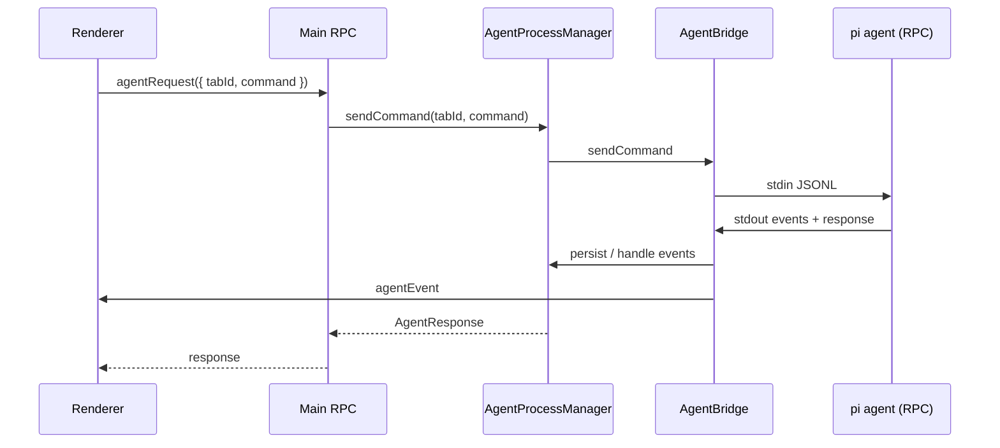

# Pi Agent Integration

Herman embeds [pi-coding-agent](https://github.com/earendil-works/pi-coding-agent) (`@earendil-works/pi-coding-agent`) as its LLM coding agent. The desktop app spawns **one RPC-mode subprocess per tab** (or wizard / headless run), talks to it over **JSONL on stdin/stdout**, and keeps pi’s on-disk state under a **single shared root `~/.herman/agent/`**. A tab is just a pi session (new or resumed by UUID) in that shared root — there is no per-tab config directory.

## Big picture

```
┌─────────────────────────────────────────────────────────────┐
│  Renderer (React)                                           │
│  agentRequest / agentEvent via Electrobun RPC               │
└────────────────────────────┬────────────────────────────────┘
                             │
┌────────────────────────────▼────────────────────────────────┐
│  Main process (Bun)                                         │
│  AgentProcessManager → AgentBridge → AgentProcess           │
│  prepareAgentDir() writes auth/models/settings per tab      │
└────────────────────────────┬────────────────────────────────┘
                             │ stdin/stdout JSONL
┌────────────────────────────▼────────────────────────────────┐
│  @herman/agent CLI  (packages/agent)                        │
│  sets PI_CODING_AGENT_DIR → pi main({ extensionFactories }) │
│  loads herman + context-reporter inline; npm packages from  │
│  shared settings.json; wizard ext via --extension CLI arg   │
└─────────────────────────────────────────────────────────────┘
```

---

## 1. Starting the agent

### CLI entry (`packages/agent`)

| Piece | Path |
|-------|------|
| CLI | `packages/agent/src/cli.ts` |
| Package bin | `herman` → `dist/herman-agent` (compiled binary) |
| Build | `packages/agent` build: `bun build --compile` → `dist/herman-agent` + `dist/theme/` + `dist/package.json`; prebuild also copies photon wasm next to the binary |
| Shared config sync | `apps/desktop/src/bun/agent-config-sync.ts` (`syncAgentConfig`) |

On start, the CLI:

1. Resolves the pi agent directory:
   - `HERMAN_AGENT_DIR` if set (desktop always sets this, to the shared `~/.herman/agent`)
   - else `packages/agent/.pi-agent/` (standalone / local CLI)
2. Points pi at that directory:
   - `PI_CODING_AGENT_DIR = HERMAN_AGENT_DIR`
   - `PI_CODING_AGENT_SESSION_DIR = {HERMAN_AGENT_DIR}/sessions`
3. Configures logging to **stderr** (stdout is reserved for RPC JSONL)
4. Forces `--mode rpc`
5. Calls pi’s `main()` with inline `extensionFactories`

The CLI no longer writes `settings.json` (no `ensureBundledExtensions`). The shared config (auth/models/settings + bundled extension install) is written once by the desktop’s `syncAgentConfig()` at startup; the CLI only reads it.

### Desktop spawn chain

```
AgentProcessManager.ensureAgentForTab()
  → AgentBridge.start()
    → await awaitAgentConfigSynced()   // shared config ready (no per-tab write)
    → AgentProcess.start()
      → Bun.spawn([herman-agent, "--mode", "rpc", ...optional "--session", path, ...optional "--extension", wizard-path])
      → AgentRpcClient.attach(subprocess)
```

| Class | File |
|-------|------|
| `AgentProcessManager` | `apps/desktop/src/bun/agent-process-manager.ts` |
| `AgentBridge` | `apps/desktop/src/bun/agent-bridge.ts` |
| `AgentProcess` | `apps/desktop/src/bun/agent-process.ts` |
| `AgentRpcClient` | `apps/desktop/src/bun/agent-rpc.ts` |

**Working directory** of the subprocess is the tab’s project folder (or wizard / headless cwd), not the agent config dir.

**Env injected by `AgentBridge`:**

| Variable | Purpose |
|----------|---------|
| `HERMAN_AGENT_DIR` | Per-session pi config root |
| `HERMAN_APP_DIR` | `~/.herman` |
| `HERMAN_TAB_ID` | Tab / wizard / headless id |
| `HERMAN_MODE` | `"rookie"` or `"normal"` |
| `HERMAN_SERVER_URL`, `HERMAN_SESSION_TOKEN` | Herman proxy (when enabled) |
| `HERMAN_PINNED_PROVIDERS` | Tab-scoped provider pins (JSON) |

Provider API keys from the parent process env are stripped; credentials come from the per-session `auth.json` written by the desktop.

**No `PI_PACKAGE_DIR` is set.** The compiled binary is self-contained: pi's `getPackageDir()` auto-detects `dirname(process.execPath)` (= `packages/agent/dist/`), where `theme/`, `package.json`, and `photon_rs_bg.wasm` are co-located. Extensions resolve `@earendil-works/*` and `typebox` via pi's `VIRTUAL_MODULES` (the compiled-binary code path), so no `node_modules` tree is needed.

### App boot

1. `apps/desktop/src/bun/index.ts` creates `AgentProcessManager` (+ wizard manager)
2. `restoreApp()` loads `window-state.json`, hydrates tabs, schedules agent starts
3. Renderer gets `tabsRestored`, `tabMessagesHydrated`, then live `agentEvent` streams

---

## 2. Desktop ↔ agent communication

### Transport

| Direction | Channel |
|-----------|---------|
| Desktop → agent | JSON lines on subprocess **stdin** |
| Agent → desktop | JSON lines on subprocess **stdout** |
| Agent logs | **stderr** only |

Parser: `apps/desktop/src/bun/jsonl.ts` (strict `\n` splitting so U+2028/U+2029 inside JSON strings stay intact).

### Protocol (`apps/desktop/src/shared/agent-protocol.ts`)

**Commands:** `prompt`, `abort`, `get_state`, `get_available_models`, `set_model`, `get_messages`, `bash`

**Responses:** `{ type: "response", id, command, success, data? | error? }`

**Events (streaming):** `agent_start`, `message_*`, `tool_execution_*`, `agent_end` / `agent_complete` / `agent_error`, `extension_ui_request`, Herman events (`models_sync`, `herman/context_report`, ads, etc.)

`AgentRpcClient.sendCommand()` assigns ids (`herman_{n}`), writes a line, waits for the matching response (default 30s). Fire-and-forget uses `sendRaw` / `sendRawObject` (e.g. `abort`, `extension_ui_response`).

### End-to-end message flow



| Layer | File |
|-------|------|
| Electrobun RPC contract | `apps/desktop/src/shared/rpc.ts` |
| Renderer bridge | `apps/desktop/src/views/main/lib/desktop-rpc-electrobun.ts` |
| User actions | `apps/desktop/src/views/main/lib/agent-actions.ts` |
| Event → UI store | `apply-agent-event` + agent store |

**Extension UI round-trip** (used by the wizard):

1. Extension calls pi UI (`ctx.ui.editor` / similar)
2. Pi emits `extension_ui_request`
3. Bridge may enrich / detect wizard envelopes (`__herman_wizard__`)
4. UI answers via `sendExtensionUiResponse`
5. Pi unblocks the tool and the LLM continues

---

## 3. Extensions

Three loading mechanisms:

| Mechanism | What | How configured |
|-----------|------|----------------|
| **`extensionFactories`** | `hermanExtension`, `contextReporterExtension` | Hardcoded in `packages/agent/src/cli.ts` `main()` — always loaded |
| **`settings.packages`** | `npm:@bacnh85/pi-fff`, `npm:@narumitw/pi-goal` | Synced into the **shared** `~/.herman/agent/settings.json` by `syncAgentConfig()`; pi installs into the shared `npm/node_modules`. Extensions import `@earendil-works/*` and `typebox` via pi’s `VIRTUAL_MODULES` (bundled into the compiled agent binary), so only the extension’s *own* deps need npm-installing. |
| **`--extension` CLI arg** | Wizard extension path | Passed by `AgentBridge.start()` only for wizard (and headless) bridges via pi’s `additionalExtensionPaths`. NOT in shared settings, so normal tabs never load wizard tools. |

### Herman extension

`packages/agent/src/extensions/herman-extension.ts`

- Registers the dynamic **`herman`** provider (proxy to Herman server)
- Syncs models, emits Herman UI events via `ctx.ui.notify`
- Rookie mode: injects guidance in `before_agent_start`
- Refuses to run if local provider API key env vars are present

### Context reporter

`packages/pi-context-reporter` — emits throttled `herman/context_report` (token / context window state).

### Wizard extension

`apps/desktop/src/bun/wizard-extension/index.ts`

- Path resolved by `resolveWizardExtensionPath()` and passed to the wizard’s `AgentBridge.start({ extensions })` → emitted as `--extension <path>` on the subprocess
- Tools: `herman_wizard_ask`, `herman_complete_wizard`
- Loaded from disk by pi (jiti); bundled into the app as `wizard-extension/`
- Normal tabs never receive this arg, so wizard tools don’t leak into chat

---

## 4. Sessions and storage paths

### Two “session” concepts

| Concept | ID | Storage |
|---------|----|---------|
| **Herman tab / wizard run** | `TabId` or `wizard-…` / `headless-…` | `~/.herman/window-state.json` (`PersistedSession`, including `piSessionId`) |
| **Pi conversation** | UUID in the JSONL filename | `~/.herman/agent/sessions/{timestamp}_{uuid}.jsonl` (flat, shared) |

### Path map

Base app data (`apps/desktop/src/bun/app-paths.ts`):

| Path | Location |
|------|----------|
| App root | `~/.herman` (macOS/Linux) or `%LOCALAPPDATA%/herman` (Windows); override `HERMAN_APP_DIR` |
| **Desktop** settings | `~/.herman/settings.json` — providers, models prefs, UI mode, disabled skills |
| Window / tabs | `~/.herman/window-state.json` |
| **Shared pi config root** | `~/.herman/agent/` (auth.json, models.json, settings.json, npm/node_modules/) |
| Pi session JSONL | `~/.herman/agent/sessions/{timestamp}_{uuid}.jsonl` (flat, shared) |
| Message cache | `~/.herman/history/{tabId}.json` |
| Standalone CLI default | `packages/agent/.pi-agent/` (when `HERMAN_AGENT_DIR` unset) |

Shared agent files (written once by `syncAgentConfig()` at startup, and on credential/settings changes — single-flight, serialized):

- `auth.json` — credentials in pi format (from desktop credential store)
- `models.json` — custom BYOK providers
- `settings.json` — pi skills patterns, `packages` (bundled extensions), plus any preserved fields (theme, user extensions)
- `npm/node_modules/` — pi-installed bundled extensions (installed once; `DefaultPackageManager.resolve()` runs during sync)

Helpers: `apps/desktop/src/bun/pi-session.ts` (`piSessionDir`, `resolvePiSessionFile`, …).

### Lifecycle

**New tab:** new `TabId` → persist → background `AgentBridge.start` (no `--session` yet; pi creates a new JSONL in the shared sessions dir). Desktop captures `sessionId` via `get_state` into `PersistedSession.piSessionId`. No config is written — the shared config already exists.

**Resume:** resolve JSONL by UUID suffix in the shared sessions dir → spawn with `--session <path>`. UI can paint from a synchronous JSONL snapshot; background `get_messages` reconciles when the agent is ready.

**Close empty tab:** `deletePiSessionFile(piSessionId)` deletes just that tab’s JSONL from the shared sessions dir (never the shared config).

**Wizard → project tab:** no JSONL copy — the wizard’s session already lives in the shared sessions dir. The wizard captures its `piSessionId` from `get_state`; the new tab simply resumes that UUID with `--session`.

---

## 5. Are pi settings shared or per-session?

**Pi’s `settings.json` is shared across all tabs/wizards/headless runs** — one file at `~/.herman/agent/settings.json`, written once by `syncAgentConfig()` at startup (and on credential/settings changes). No per-tab config directories exist.

There are two different files named `settings.json`:

| File | Scope | Contents |
|------|-------|----------|
| `~/.herman/settings.json` | **Global desktop app** | Providers, model prefs, rookie/normal mode, `disabledSkills` |
| `~/.herman/agent/settings.json` | **Shared pi agent root** | `skills`, `packages` (bundled extensions), theme, user extensions |

Evidence:

- Desktop writes the shared config under `agentDir()` (`syncAgentConfig` in `agent-config-sync.ts`), once at startup.
- CLI binds pi to `HERMAN_AGENT_DIR` = the shared `~/.herman/agent` (`PI_CODING_AGENT_DIR` / `PI_CODING_AGENT_SESSION_DIR` in `cli.ts`).
- Every tab/wizard/headless bridge gets the same `HERMAN_AGENT_DIR`.

### Shared vs per-session cheat sheet

| Artifact | Shared across tabs? | Notes |
|----------|---------------------|-------|
| Desktop `settings.json` | Yes (global) | Source of truth for providers / skills toggles / UI mode |
| Pi `settings.json` | **Yes** | One shared file at `~/.herman/agent/settings.json` |
| Pi `auth.json` / `models.json` | **Yes** | One shared file, rewritten by `syncAgentConfig` on changes |
| `settings.packages` (pi-fff, pi-goal) | **Yes** | Synced into the shared settings; installed once into shared `npm/node_modules` |
| Wizard extension | **No** (per-spawn) | Passed via `--extension` CLI arg only for wizard/headless, not in shared settings |
| Inline extensions (herman, context-reporter) | Same **code** in every process | Not loaded from settings files |
| Session JSONL | **No** (per conversation) | Flat in shared `sessions/`; identified by UUID; tab close deletes one file |
| Herman models cache | Yes | `~/.herman/herman-models-cache.json` |

`mergeAgentSettings` **preserves** user-managed fields in the shared pi `settings.json` (e.g. theme, user `extensions`) across syncs, while overwriting Herman-managed `skills` and `packages`.

So: **one shared pi profile for config/extensions; many sessions-by-UUID in the flat `sessions/` dir.** A tab is just a session (new or resumed) in that shared root.

---

## 6. Normal tab vs wizard vs headless

| | Normal tab | Wizard | Headless |
|--|------------|--------|----------|
| Orchestrator | `AgentProcessManager` | `WizardSession` / manager | `runHeadlessAgentPrompt` (`headless-agent.ts`) |
| Agent dir | **shared `~/.herman/agent`** | **shared `~/.herman/agent`** | **shared `~/.herman/agent`** |
| `cwd` | Project (or worktree) | Projects parent (`~/Herman`) | `~/Herman/.headless` |
| `HERMAN_MODE` | From desktop settings | Always `rookie` | Always `rookie` |
| Wizard ext | — | via `--extension` arg | — |
| UI events | `agentEvent` | `wizardEvent` | Internal callback |
| Cleanup | Keep session JSONL if conversation; else delete one file | Cancel deletes cloned project; session JSONL stays for handoff | Deletes its own session JSONL |

---

## 7. Startup sequence (condensed)

1. **Build:** prebuild → `@herman/agent` compiled binary (`bun build --compile`) + theme/package.json/photon wasm co-located in `dist/` → copied into Electrobun app
2. **Launch:** `restoreApp()` kicks off `syncAgentConfig()` (non-blocking) + restores tabs from `window-state.json`
3. **Sync:** `syncAgentConfig` writes shared `auth/models/settings` into `~/.herman/agent` and installs bundled extensions once (serialized; tabs await it before spawning)
4. **Per open project tab:** hydrate from JSONL snapshot (instant UI) → background `AgentBridge.start` awaits sync → spawn `herman-agent --mode rpc [--session …]`
5. **CLI:** set `PI_CODING_AGENT_*`, load inline + disk extensions, enter pi RPC loop (no settings writes)
6. **Hydrate:** JSONL snapshot already painted; `get_messages` reconciles when ready
7. **Prompt:** renderer → `agentRequest` → stdin `prompt` → stdout events → `agentEvent` → UI

---

## Key files

| Concern | Path |
|---------|------|
| Agent CLI | `packages/agent/src/cli.ts` |
| Herman extension | `packages/agent/src/extensions/herman-extension.ts` |
| Context reporter | `packages/pi-context-reporter/` |
| Wizard extension | `apps/desktop/src/bun/wizard-extension/` |
| Shared config sync | `apps/desktop/src/bun/agent-config-sync.ts` |
| Project → sessions (native pi) | `apps/desktop/src/bun/pi-sessions.ts` |
| Multi-tab orchestration | `apps/desktop/src/bun/agent-process-manager.ts` |
| Subprocess | `apps/desktop/src/bun/agent-process.ts` |
| JSONL RPC client | `apps/desktop/src/bun/agent-rpc.ts` |
| Session paths | `apps/desktop/src/bun/pi-session.ts` |
| App paths | `apps/desktop/src/bun/app-paths.ts` |
| Protocol types | `apps/desktop/src/shared/agent-protocol.ts` |
| Wizard orchestration | `apps/desktop/src/bun/wizard-session.ts` |
| Desktop overview | `apps/desktop/AGENTS.md` |
