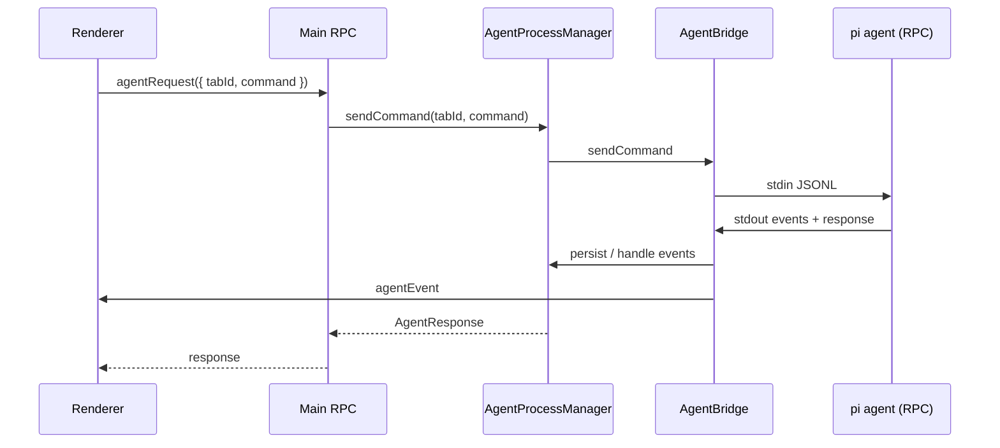

# Pi Agent Integration

Herman embeds [pi-coding-agent](https://github.com/earendil-works/pi-coding-agent) (`@earendil-works/pi-coding-agent`) as its LLM coding agent. The desktop app spawns **one RPC-mode subprocess per tab** (or wizard / headless run), talks to it over **JSONL on stdin/stdout**, and keeps pi’s on-disk state under a **single shared root** (`~/.herman/agent/` by default). A tab is just a pi session (new or resumed by UUID) in that shared root — there is no per-tab config directory.

For current filenames, env vars, protocol commands, and bundled packages, treat the linked source as the source of truth. This doc describes architecture and ownership; those details change more often than the shape below.

## Big picture

```
┌─────────────────────────────────────────────────────────────┐
│  Renderer (React)                                           │
│  agentRequest / agentEvent via Electrobun RPC               │
└────────────────────────────┬────────────────────────────────┘
                             │
┌────────────────────────────▼────────────────────────────────┐
│  Main process (Bun)                                         │
│  AgentProcessManager → AgentBridge → AgentProcess           │
│  syncAgentConfig() writes shared auth/models/settings       │
└────────────────────────────┬────────────────────────────────┘
                             │ stdin/stdout JSONL
┌────────────────────────────▼────────────────────────────────┐
│  @herman/agent CLI  (packages/agent)                        │
│  sets PI_CODING_AGENT_DIR → pi main({ extensionFactories }) │
│  inline extensions always; npm packages from shared         │
│  settings; spawn-only extensions via --extension            │
└─────────────────────────────────────────────────────────────┘
```

---

## 1. Starting the agent

### CLI entry (`packages/agent`)

| Piece | Path |
|-------|------|
| CLI | `packages/agent/src/cli.ts` |
| Package bin / build output | see `packages/agent` package scripts |
| Shared config sync | `apps/desktop/src/bun/agent-config-sync.ts` (`syncAgentConfig`) |

On start, the CLI:

1. Resolves the pi agent directory (`HERMAN_AGENT_DIR` when set by desktop; otherwise a local default under `packages/agent`)
2. Points pi at that directory (`PI_CODING_AGENT_DIR` / session dir under it)
3. Configures logging to **stderr** (stdout is reserved for RPC JSONL)
4. Forces RPC mode
5. Calls pi’s `main()` with inline `extensionFactories`

The CLI does not own shared config writes. Desktop’s `syncAgentConfig()` writes auth/models/settings (and installs packages declared there) once at startup and on relevant settings/credential changes; the CLI only reads that tree.

### Desktop spawn chain

```
AgentProcessManager.ensureAgentForTab()
  → AgentBridge.start()
    → await awaitAgentConfigSynced()   // shared config ready (no per-tab write)
    → AgentProcess.start()
      → spawn herman-agent in RPC mode
        (+ optional --session path, optional --extension paths)
      → AgentRpcClient.attach(subprocess)
```

| Class | File |
|-------|------|
| `AgentProcessManager` | `apps/desktop/src/bun/agent-process-manager.ts` |
| `AgentBridge` | `apps/desktop/src/bun/agent-bridge.ts` |
| `AgentProcess` | `apps/desktop/src/bun/agent-process.ts` |
| `AgentRpcClient` | `apps/desktop/src/bun/agent-rpc.ts` |

**Working directory** of the subprocess is the tab’s project folder (or wizard / headless cwd), not the agent config dir.

Env injected by `AgentBridge` (tab id, mode, shared agent dir, proxy credentials when enabled, etc.) is defined in that file. Provider API keys from the parent process env are stripped; credentials come from the shared `auth.json` written by desktop.

The compiled agent binary is self-contained under `packages/agent`’s build output. Extension imports of `@earendil-works/*` / related modules go through pi’s virtual-module path in the compiled binary — see `packages/agent` and pi’s package resolution for the current layout.

### App boot

1. `apps/desktop/src/bun/index.ts` creates `AgentProcessManager` (+ wizard manager)
2. `restoreApp()` loads window state, hydrates tabs, schedules agent starts
3. Renderer gets restore / hydrate events, then live `agentEvent` streams

---

## 2. Desktop ↔ agent communication

### Transport

| Direction | Channel |
|-----------|---------|
| Desktop → agent | JSON lines on subprocess **stdin** |
| Agent → desktop | JSON lines on subprocess **stdout** |
| Agent logs | **stderr** only |

Parser: `apps/desktop/src/bun/jsonl.ts` (strict `\n` splitting so U+2028/U+2029 inside JSON strings stay intact).

### Protocol

Command, response, and event shapes live in `apps/desktop/src/shared/agent-protocol.ts`. The client assigns request ids, writes a line, and waits for the matching response (or sends fire-and-forget for abort / extension UI replies). See `AgentRpcClient` in `apps/desktop/src/bun/agent-rpc.ts`.

### End-to-end message flow



| Layer | File |
|-------|------|
| Electrobun RPC contract | `apps/desktop/src/shared/rpc.ts` |
| Renderer bridge | `apps/desktop/src/views/main/lib/desktop-rpc-electrobun.ts` |
| User actions | `apps/desktop/src/views/main/lib/agent-actions.ts` |
| Event → UI store | `apply-agent-event` + agent store |

**Extension UI round-trip** (used by the wizard):

1. Extension calls pi UI (`ctx.ui.editor` / similar)
2. Pi emits `extension_ui_request`
3. Bridge may enrich / detect Herman wizard envelopes
4. UI answers via `sendExtensionUiResponse`
5. Pi unblocks the tool and the LLM continues

---

## 3. Extensions

Three loading mechanisms (what is loaded via which path can change; the split is stable):

| Mechanism | Role |
|-----------|------|
| **`extensionFactories`** | Always-on Herman-owned extensions, hardcoded in `packages/agent` CLI `main()` |
| **`settings.packages`** | Bundled npm extensions declared in the shared pi `settings.json` by `syncAgentConfig()`; installed into the shared `npm/` tree |
| **`--extension` CLI arg** | Spawn-scoped paths (wizard / headless). Not in shared settings, so normal tabs never load them |

### Herman extension

`packages/agent/src/extensions/herman-extension.ts` — Herman provider registration, model sync / UI notifies, rookie guidance, and related process policies. See the file for current behavior.

### Context reporter

`packages/pi-context-reporter` — reports context-window / token state to the desktop (Herman event name in that package).

### Wizard extension

`apps/desktop/src/bun/wizard-extension/` — path resolved at spawn and passed only for wizard (and headless where applicable) via `--extension`. Normal tabs never receive this arg.

---

## 4. Sessions and storage paths

### Two “session” concepts

| Concept | ID | Storage |
|---------|----|---------|
| **Herman tab / wizard run** | `TabId` or wizard / headless id | Window state (`PersistedSession`, including `piSessionId`) under the app data root |
| **Pi conversation** | UUID in the JSONL filename | Shared `sessions/` under the pi agent root |

### Path map

Resolved by `apps/desktop/src/bun/app-paths.ts` (and helpers in `pi-session.ts`):

| Concern | Location (defaults) |
|---------|---------------------|
| App root | `~/.herman` (macOS/Linux) or `%LOCALAPPDATA%/herman` (Windows); overridable |
| Desktop settings | `{app}/settings.json` |
| Window / tabs | `{app}/window-state.json` |
| Shared pi config root | `{app}/agent/` (`auth.json`, `models.json`, `settings.json`, `npm/`, …) |
| Pi session JSONL | `{app}/agent/sessions/` (flat, shared) |
| Message cache | under `{app}/history/` |
| Standalone CLI default | under `packages/agent` when `HERMAN_AGENT_DIR` is unset |

Shared agent files are written by `syncAgentConfig()` at startup and on credential/settings changes (single-flight). Exact fields in `settings.json` and which packages live under `settings.packages` are owned by `agent-config-sync.ts` — do not assume a fixed package list here.

Session path helpers: `apps/desktop/src/bun/pi-session.ts`.

### Lifecycle

**New tab:** new `TabId` → persist → background `AgentBridge.start` (no `--session` yet; pi creates a new JSONL). Desktop captures `sessionId` via `get_state` into `PersistedSession.piSessionId`. Shared config already exists.

**Resume:** resolve JSONL by UUID in the shared sessions dir → spawn with `--session <path>`. UI may paint from a JSONL snapshot; `get_messages` reconciles when the agent is ready.

**Close empty tab:** delete that conversation’s JSONL only (never the shared config).

**Wizard → project tab:** no JSONL copy — the wizard’s session already lives in the shared sessions dir; the new tab resumes that UUID with `--session`.

---

## 5. Shared vs per-session

**Pi’s agent config root is shared** across all tabs/wizards/headless runs. There are no per-tab config directories.

There are two different `settings.json` files:

| File | Scope |
|------|-------|
| Desktop `{app}/settings.json` | Global desktop app (providers, UI mode, skill toggles, …) |
| Pi `{app}/agent/settings.json` | Shared pi agent root (skills, packages, user-preserved fields, …) |

Evidence: `syncAgentConfig` writes under `agentDir()`; every bridge gets the same `HERMAN_AGENT_DIR`; the CLI binds pi to that directory.

| Artifact | Shared across tabs? | Notes |
|----------|---------------------|-------|
| Desktop settings | Yes (global) | Source of truth for providers / skills toggles / UI mode |
| Pi `settings.json` / `auth.json` / `models.json` | Yes | One set, rewritten by `syncAgentConfig` on changes |
| Bundled packages (`settings.packages`) | Yes | Declared + installed into shared `npm/` during sync |
| Wizard (spawn-only) extension | No | `--extension` only for wizard/headless |
| Inline extensions | Same code every process | Not loaded from settings files |
| Session JSONL | No (per conversation) | Flat in shared `sessions/`; tab close may delete one file |

`mergeAgentSettings` (in config sync) overwrites Herman-managed fields and preserves user-managed ones (e.g. theme, user extensions). Exact managed vs preserved keys live in that code.

So: **one shared pi profile for config/extensions; many sessions-by-UUID in the flat `sessions/` dir.**

---

## 6. Normal tab vs wizard vs headless

| | Normal tab | Wizard | Headless |
|--|------------|--------|----------|
| Orchestrator | `AgentProcessManager` | `WizardSession` / manager | `headless-agent.ts` |
| Agent dir | shared | shared | shared |
| `cwd` | Project (or worktree) | Projects parent | Headless cwd under app data |
| Mode | From desktop settings | Rookie | Rookie |
| Wizard ext | — | via `--extension` | as applicable |
| UI events | `agentEvent` | `wizardEvent` | Internal callback |
| Cleanup | Keep or delete session JSONL per tab rules | Project / handoff rules in wizard code | Deletes its own session JSONL |

Current cwd and cleanup details: see the orchestrator files above.

---

## 7. Startup sequence (condensed)

1. **Build:** compile `@herman/agent` (+ colocated assets) into the Electrobun app — see package / desktop build scripts
2. **Launch:** `restoreApp()` starts `syncAgentConfig()` (non-blocking) and restores tabs
3. **Sync:** shared auth/models/settings + package install once; tabs await before spawn
4. **Per open tab:** hydrate from JSONL snapshot if available → `AgentBridge.start` → spawn in RPC mode (optional `--session`)
5. **CLI:** bind `PI_CODING_AGENT_*`, load extensions, enter pi RPC loop (no settings writes)
6. **Hydrate / prompt:** reconcile via protocol; user prompts flow renderer → `agentRequest` → stdin → stdout events → UI

---

## Key files

| Concern | Path |
|---------|------|
| Agent CLI | `packages/agent/src/cli.ts` |
| Herman extension | `packages/agent/src/extensions/herman-extension.ts` |
| Context reporter | `packages/pi-context-reporter/` |
| Wizard extension | `apps/desktop/src/bun/wizard-extension/` |
| Shared config sync | `apps/desktop/src/bun/agent-config-sync.ts` |
| Project → sessions (native pi) | `apps/desktop/src/bun/pi-sessions.ts` |
| Multi-tab orchestration | `apps/desktop/src/bun/agent-process-manager.ts` |
| Subprocess | `apps/desktop/src/bun/agent-process.ts` |
| JSONL RPC client | `apps/desktop/src/bun/agent-rpc.ts` |
| Session paths | `apps/desktop/src/bun/pi-session.ts` |
| App paths | `apps/desktop/src/bun/app-paths.ts` |
| Protocol types | `apps/desktop/src/shared/agent-protocol.ts` |
| Wizard orchestration | `apps/desktop/src/bun/wizard-session.ts` |
| Desktop overview | `apps/desktop/AGENTS.md` |
